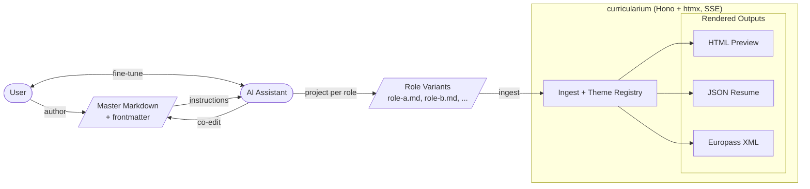

# curricularium

Local-only web app that turns a folder of markdown CV sources into polished, multi-format curricula. Pick a variant, pick an output, pick a theme, and watch a live preview update on every save.

## Highlights

- **Markdown in, many formats out.** Author a single canonical CV in markdown with frontmatter; render it to HTML, JSON Resume, or Europass XML.
- **Live preview with hot reload.** A chokidar watcher pipes file changes through Server-Sent Events to the browser; the HTML output rewrites on disk on every save.
- **Variant-aware sources.** A registered source points at a `publish/` root; each `<variant>/variant.md` is auto-discovered and listed in the UI.
- **Theme catalog.**
  - HTML output ships an in-house `linkedin-spiritual` theme as the default.
  - JSON Resume output ships a `raw` resume.json passthrough plus curated community themes (`elegant`, `kendall`, `flat`, `stackoverflow`, `even`, `macchiato`, `papirus`, `pico`, `sceptile`, `striking`, `academic`, `architects-portfolio`, `classy`, `engineering-leader`, `graph-paper-grid`, `sidebar`, `apage`).
  - Europass output ships a `canonical` XML theme.
- **Esbuild-bundled community themes.** Themes shipping raw JSX `.js` (graph-paper-grid, sidebar, etc.) are transparently bundled and cached under `~/.cache/curricularium/themes-build/` so Node's native `import` cannot break them.
- **Best-effort validation.** Spec violations surface as banner warnings; only an unparseable `variant.md` blocks a render. The author stays the gatekeeper.
- **Explicit Generate.** A single button writes `<variantName>-<outputId>[-<themeId>]<ext>` to the configured output folder (default `<sourcePath>/../_out`) and reveals it with `xdg-open`.
- **htmx + Hono JSX UI.** Server-rendered shell, partial updates over `hx-*`, no client framework, no bundler in the request path.

## Architecture

The user hand-authors a canonical master markdown set and iterates on it with an external AI assistant. The AI then projects role-specific variant markdown files from that master, which curricularium ingests via its theme registry to render HTML previews (live over SSE), JSON Resume, and Europass XML.



## Project layout

```
packages/
  core/        Loader, spec model, output + theme registry, render pipeline
  server/      Hono server, htmx-driven UI, SSE watcher, route handlers
docs/          Reference material
```

- `@curricularium/core` — markdown loader, canonical CV model, output/theme registry, JSON Resume community theme bundler, HTML + Europass adapters.
- `@curricularium/server` — Hono HTTP server, htmx-rendered shell, source registry, file watcher, SSE preview pipe, generate route.

## Technical requirements

- **Node.js** ≥ 20 (target `node20`, `ES2022` lib).
- **pnpm** 9 (the repo pins `packageManager: pnpm@9.0.0`).
- **TypeScript** 5.6+ (provided via devDependencies; no global install needed).
- **Linux / macOS** for `xdg-open` / `open` integration; Windows works for build and preview but the "Open file" button targets `xdg-open`.
- **Outbound npm registry access** at install time to pull JSON Resume community themes.
- Approx. 500 MB disk for `node_modules` + the on-disk theme bundle cache.

### Runtime dependencies

- `hono`, `@hono/node-server` — HTTP + JSX shell.
- `htmx.org` — vendored to `packages/server/src/static/htmx.min.js` via `pnpm vendor:htmx`.
- `chokidar` — markdown source watcher.
- `gray-matter`, `marked` — frontmatter + markdown parsing.
- `zod` — schema validation for spec and config.
- `esbuild` — on-demand bundling for community JSON Resume themes.
- `ulid` — stable IDs for sources and generate events.

## Run

```bash
pnpm install
pnpm vendor:htmx                       # one-shot, vendors htmx.min.js into server static/
pnpm -F @curricularium/server dev      # http://localhost:3000
```

Override the port with `PORT=4000 pnpm -F @curricularium/server dev`.

## Scripts

| Command | What it does |
|---|---|
| `pnpm dev` | Starts the server in watch mode (`tsx watch`). |
| `pnpm test` | Runs the core vitest suite. |
| `pnpm typecheck` | Recursive `tsc --noEmit` across workspaces. |
| `pnpm vendor:htmx` | Copies htmx.min.js into `packages/server/src/static/`. |

## Source shape

A registered source points at a `publish/` root. Each `<variant>/variant.md` is auto-discovered. The CV spec lives in `packages/core/src/spec/` (canonical model, atoms, lints, banned-strings). A manual smoke fixture is available at `packages/core/test/fixtures/variants/` — register that path as a source to exercise every atom type via the `minimal` variant.

## Generate flow

1. Pick `(variant, output, theme)` in the shell.
2. Click **Generate**.
3. The server writes the artifact to the output folder and surfaces the path in the UI; **Open file** invokes `xdg-open`.

## Trust boundary

Local-only, single-user, bound to localhost. Markdown source files are owned by the user. Body markdown is rendered to HTML without sanitization. If the scope ever grows beyond a single local user, add a sanitizer before that change ships.
